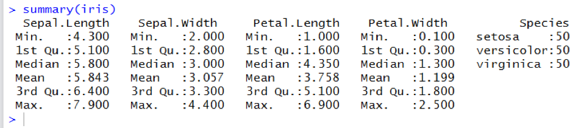

---
jupyter:
  jupytext:
    text_representation:
      extension: .Rmd
      format_name: rmarkdown
      format_version: '1.0'
      jupytext_version: 0.8.6
  kernelspec:
    display_name: Python 3
    language: python
    name: python3
---

## Question 1 (8 points)
Choose either Python or R for the entirety of this question.

A U.S graduate school has students from Asia, Europe, and America. The students' continents of origin and colleges are stored in a data frame STUDENTS. You can assume that there may be duplicate records, as shown below:


| name   | continent |  college    |
|--------|-----------|-------------|
|  Andy  | America   |  Lib Arts   |
|  Jose  | Europe    |  Business   |
|  Dieu  | Asia      | Engineering |
|  Chloe | America   | Engineering |
|  Jose  | Europe    |  Business   |

Please write R or Pandas code to create a new data frame COUNTS that counts the number of unique student records corresponding to each continent, college pair. Lay out the data in a 3x3 grid with colleges sorted reverse alphabetically on the vertical axis. The horizontal axis does not need to be sorted. Null values should be zero-filled. For the sample input, the desired output would be:

|  continent  | America | Asia | Europe |
|-------------|---------|------|--------|
|**college**  |         |      |        |
|  Lib Arts   |    1    |  0   |   0    |
| Engineering |    1    |  1   |   0    |
|  Business   |    0    |  0   |   1    |


### Solution

```{python}
import pandas as pd
import numpy as np
import matplotlib as plt
# %matplotlib inline
```

Let us create the sample data

```{python}
df = pd.DataFrame({'name':['Andy','Jose','Dieu','Chloe','Jose'],
                   'continent':['America','Europe','Asia','America','Europe'],
                   'college':['Lib Arts','Business','Engineering','Engineering','Business']})
```

```{python}
df
```

To get the necessary solution, we will use pandas groupby operation

```{python}
df_group = (df.drop_duplicates() #This will remove the duplicate records from the dataframe
              .groupby(by=['college','continent'],axis=0) # This item will groupby on college and continent.
              .count() # get counts of deduped dataset as a part of groupby
              .unstack()  # unstacks a multiindex resulting from groupby based on two columns
              .fillna(0)  # fills NAs with 0s
              .sort_values(by='college',ascending=False) # sort the resulting values by college in reverse alphabetical order
              .astype(int)) # converts the default floats to integers
df_group.columns = df_group.columns.droplevel() # drops the 'name' level
df_group
```

## Question 2 (6 points)
#### Python track


### A


Of the months April, May, and June, calculate how many had eggs>100


### Answer


<font color='green'; size=4em>
A) (df.loc[['apr','may','jun'],]['eggs']>100).sum()**
</font>


### B


Output
datetime.date(2018, 1, 1)


### Answer
Script


import datetime

datetime.datetime.**strptime**('01012018',"%d%m%Y").**date()**


<font color='green'; size=4em>
A) strptime, .date()
</font>


### C


Select the correct script to accomplish the task
Following is a summary of the iris dataset:




How would you create a new object with:
-	only the “setosa” species 
-	Petal.Width greater than 2
-	Sorted by Sepal.Length in descending order


### Answer


<font color='green'; size=4em>
B) iris.loc[(iris['Species'] == 'setosa') & (iris['Petal.Width'] > 2)].sort_values('Sepal.Length', ascending = False)
</font>

```{python}

```
